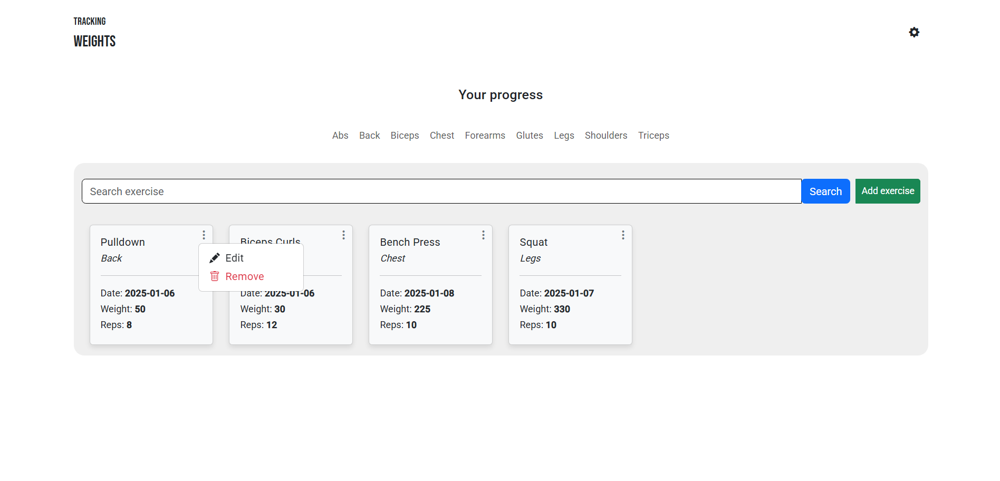
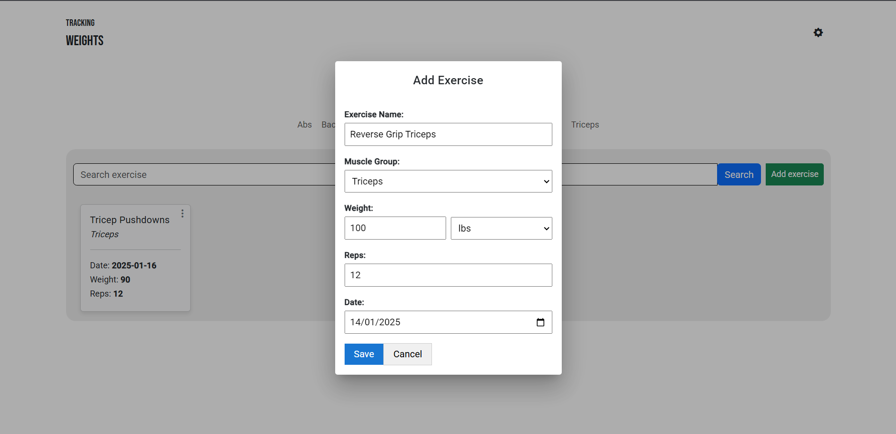

# 🎥 Tracking Weights

Project to track weights used in exercise sessions

    

        
        
    

## 🛠️ Technologies Used

- **Front-end**: Angular
- **Back-end**: Spring Boot
- **Database**: MySQL

## ✨ Features

- 🔍 Search for exercises
- ➕ Add exercises
- 📄 Track the weight you lifted in your last gym session

## 📋 Requirements

- Node.js
- Angular CLI
- Java
- Maven
- MySQL

## 📄 License

This project is licensed under the MIT License 
